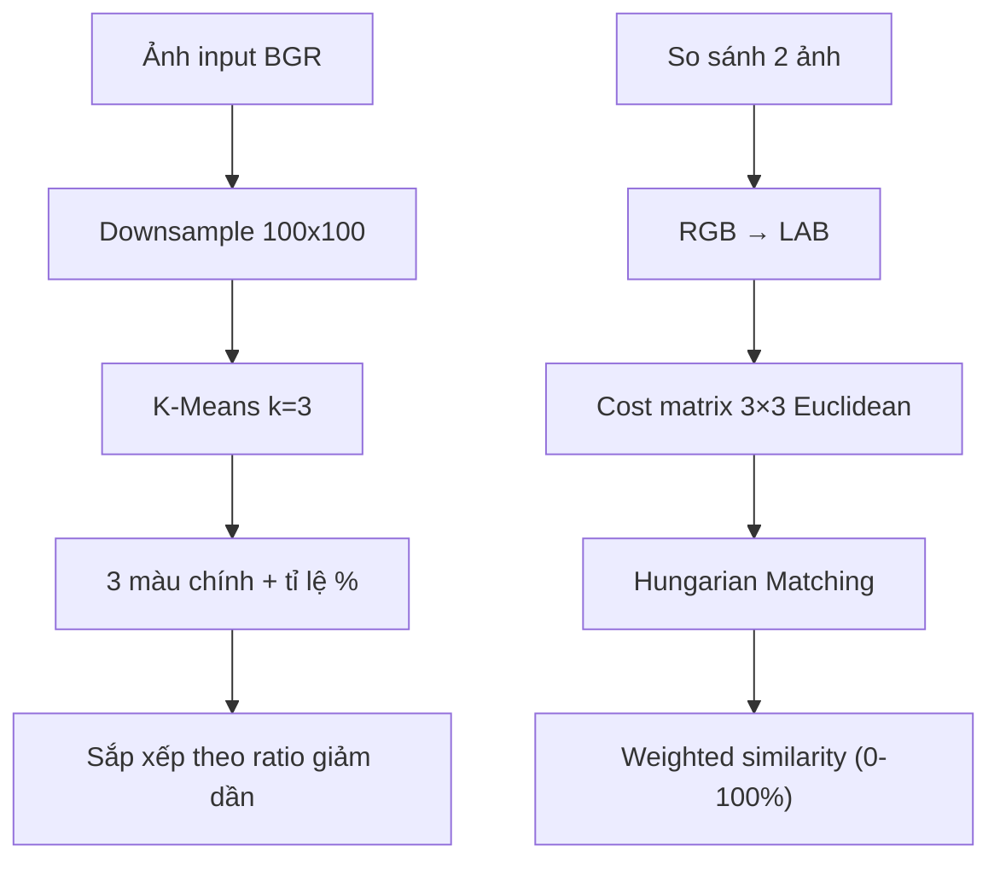

# Walkthrough: 3 Dominant Colors Extraction & Similarity

## Tổng quan thay đổi

Thay thế thuật toán Histogram Intersection cũ bằng thuật toán **3 Dominant Colors + Hungarian Matching trong LAB color space**.

## Files đã thay đổi

| File | Thay đổi |
|------|----------|
| [image_processor.py](file:///d:/Ki_2_nam_4/CSDL-PT/api/services/image_processor.py) | Thêm [_extract_top_colors()](file:///d:/Ki_2_nam_4/CSDL-PT/api/services/image_processor.py#166-207), [_compute_color_similarity()](file:///d:/Ki_2_nam_4/CSDL-PT/api/services/image_processor.py#208-274), cập nhật [extract_features()](file:///d:/Ki_2_nam_4/CSDL-PT/api/services/image_processor.py#62-134) và [compute_similarity()](file:///d:/Ki_2_nam_4/CSDL-PT/api/services/image_processor.py#318-350) |
| [database.py](file:///d:/Ki_2_nam_4/CSDL-PT/api/models/database.py) | Thêm cột `dominant_colors_json` |
| [database_service.py](file:///d:/Ki_2_nam_4/CSDL-PT/api/services/database_service.py) | Lưu `dominant_colors_json` khi create/update |
| [schemas.py](file:///d:/Ki_2_nam_4/CSDL-PT/api/models/schemas.py) | Thêm field [dominant_colors](file:///d:/Ki_2_nam_4/CSDL-PT/api/routes/images.py#32-41) vào response |
| [images.py](file:///d:/Ki_2_nam_4/CSDL-PT/api/routes/images.py) | Truyền [dominant_colors](file:///d:/Ki_2_nam_4/CSDL-PT/api/routes/images.py#32-41) vào tất cả response + search dùng color similarity |
| [requirements.txt](file:///d:/Ki_2_nam_4/CSDL-PT/api/requirements.txt) | Thêm `scipy>=1.11.0` |

## Thuật toán mới



## Cần làm trước khi chạy

> [!IMPORTANT]
> Cần thêm cột mới vào DB và cài scipy trước khi chạy.

1. **Cài scipy**: `pip install scipy>=1.11.0`
2. **Thêm cột DB**: Chạy SQL sau trên PostgreSQL:
   ```sql
   ALTER TABLE image_metadata ADD COLUMN dominant_colors_json TEXT;
   ```
3. **Recompute** tất cả ảnh cũ: Gọi `POST /api/images/recompute` để cập nhật features cho ảnh hiện có, hoặc chạy lại `python import_db.py`.
